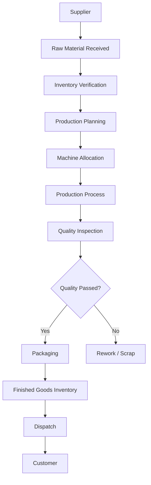
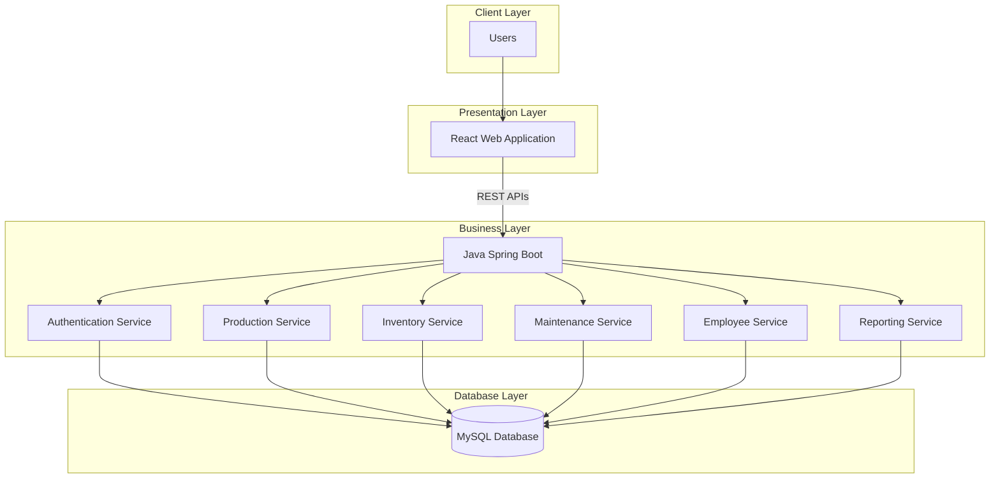
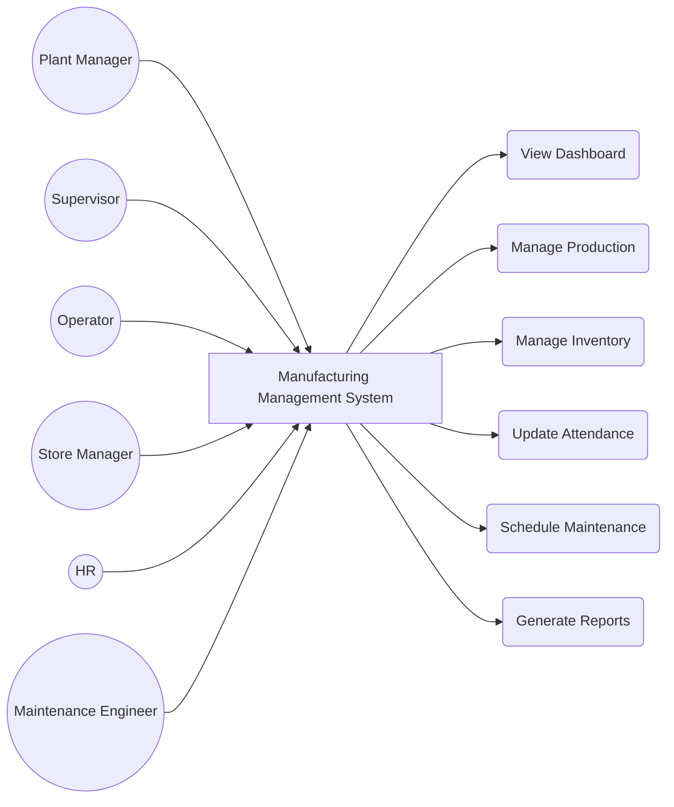
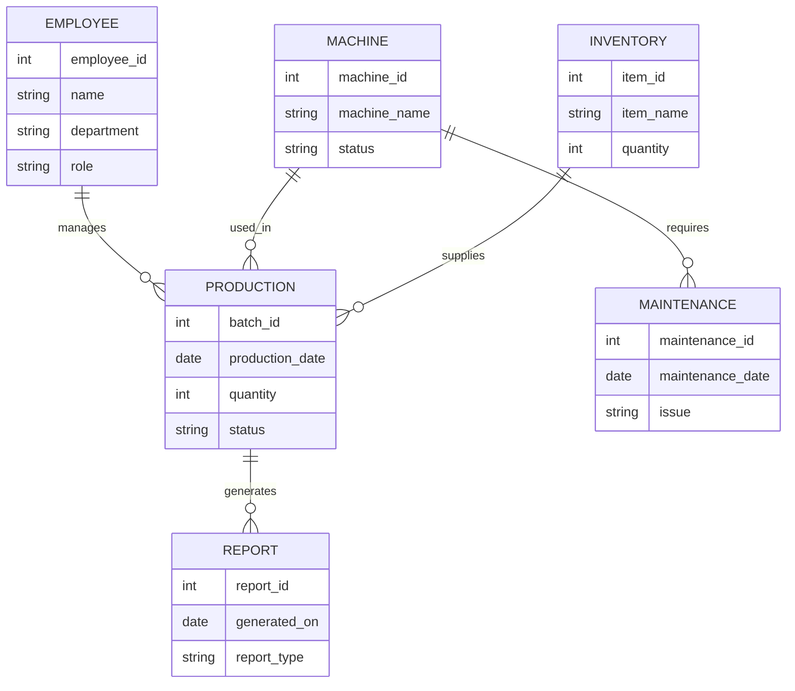
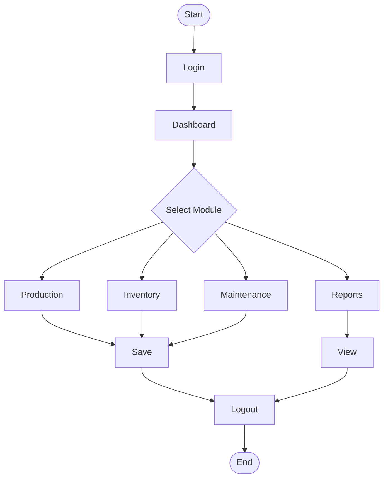
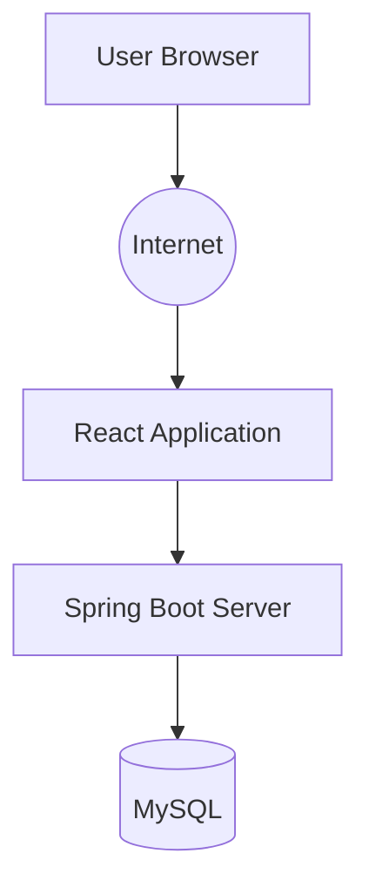

# Manufacturing Management System

> **Business Case Study | Software Design | System Architecture | Database Design**


---

## 📖 Overview

This repository presents a software engineering case study for a Manufacturing Management System designed for small and medium-sized manufacturing industries.

The objective of this project was to understand how software can improve manufacturing operations by analysing existing business processes and designing a centralized software solution.

Instead of developing the application, this project focuses on requirement analysis, software architecture, database planning, module design, and business workflow.

---

##  Business Scenario

A manufacturing company produces products in multiple production batches every day. Most operational activities are recorded manually using paper registers and Excel sheets.

As production increases, managing information manually becomes difficult and often leads to delays, duplicate records, and communication gaps between departments.

This case study proposes a centralized web-based system that helps manage production, inventory, maintenance, employees, and reporting from a single platform.

---

##  Problem Statement

The existing workflow depends heavily on manual processes.

Some common challenges include:

- Manual production records
- Inventory mismatches
- Delayed report generation
- Machine maintenance not tracked properly
- No centralized dashboard
- Difficult communication between departments
- Time-consuming data retrieval

---

##  Objectives

- Digitize manufacturing operations
- Reduce paperwork
- Improve inventory visibility
- Track production in real time
- Schedule preventive maintenance
- Generate reports automatically
- Improve decision making using dashboards

---
## Current Manufacturing Workflow

The following diagram represents a typical manufacturing workflow observed in small and medium-scale manufacturing industries.



---

## 💡 Proposed Software Solution

The proposed Manufacturing Management System centralizes different business operations into a single platform.

Instead of maintaining separate Excel sheets and paper records, every department interacts with one integrated system.

The software is divided into multiple independent modules, making it scalable and easier to maintain.

---

## Proposed Modules

### 📊 Dashboard

Provides a quick overview of manufacturing activities.

Features:

- Daily Production Summary
- Machine Utilization
- Employee Attendance
- Inventory Alerts
- Pending Maintenance
- Recent Activities

---

###  Production Management

Responsible for handling daily production activities.

Features:

- Create Production Batch
- Assign Machine
- Assign Operator
- Track Production Status
- Close Production Batch
- View Production History

---

### Inventory Management

Maintains stock details for raw materials and finished products.

Features:

- Add New Items
- Update Stock
- Low Stock Alerts
- Supplier Information
- Stock Movement History

---

### 🔧 Maintenance Management

Helps track machine servicing and breakdown history.

Features:

- Preventive Maintenance Schedule
- Breakdown Reporting
- Maintenance History
- Machine Availability
- Service Log

---

### Employee Management

Stores employee information and manages attendance.

Features:

- Employee Records
- Shift Allocation
- Attendance
- Department Information

---

### Reports

Generates business reports automatically.

Reports include:

- Daily Production Report
- Monthly Production Report
- Inventory Report
- Machine Downtime Report
- Employee Attendance Report

---

##  Stakeholders

The following users interact with the proposed system.

| User | Responsibilities |
|------|------------------|
| Plant Manager | Monitor production and reports |
| Production Supervisor | Manage production batches |
| Machine Operator | Update production status |
| Store Manager | Manage inventory |
| Maintenance Engineer | Handle machine servicing |
| HR | Employee records and attendance |
| Management | Business insights and analytics |

---

## Expected Benefits

- Centralized business data
- Reduced paperwork
- Faster report generation
- Better inventory tracking
- Improved maintenance planning
- Better communication between departments
- Increased operational efficiency
  # 🏗️ System Design

## Software Architecture

The proposed system follows a **3-tier architecture**, where the presentation layer communicates with the backend through REST APIs, and the backend manages all business logic and database operations.



---

#  Use Case Diagram

The following diagram shows how different users interact with the system.



---

#  Entity Relationship Diagram



---

#  Activity Diagram



---

#  Deployment Diagram



---

##  Design Approach

The proposed solution follows a modular architecture where each business function is implemented independently. This makes the application easier to maintain, extend, and test. Communication between the frontend and backend takes place through REST APIs, while all business data is stored in a centralized relational database.

The design allows future enhancements such as mobile applications, barcode integration, IoT-enabled machine monitoring, and predictive maintenance without major architectural changes.
---

#  Repository Structure

```
Manufacturing-Management-System
│
├── README.md
│
├── diagrams
│   ├── system-architecture.png
│   ├── business-workflow.png
│   ├── use-case-diagram.png
│   ├── er-diagram.png
│   ├── activity-diagram.png
│   └── deployment-diagram.png
│
├── database
│   ├── schema.sql
│   └── sample-data.sql
│
├── docs
│   ├── Business_Case_Study.pdf
│   ├── SRS.pdf
│   ├── API_Documentation.pdf
│   └── Future_Enhancements.md
│
└── wireframes
    ├── login.png
    ├── dashboard.png
    ├── production.png
    ├── inventory.png
    ├── maintenance.png
    └── reports.png
```

---

#  Functional Requirements

The proposed system should provide the following features:

- User Authentication
- Role Based Access Control
- Production Management
- Inventory Management
- Employee Management
- Machine Maintenance
- Report Generation
- Dashboard Analytics
- Search & Filter Records
- Notification System

---

# ⚙️ Non-Functional Requirements

| Requirement | Description |
|-------------|-------------|
| Performance | Fast response time for daily operations |
| Availability | Accessible during production hours |
| Security | Secure login and role-based permissions |
| Scalability | Easy to add new modules in future |
| Reliability | Accurate storage of production records |
| Maintainability | Modular software architecture |

---

#  Proposed Database Tables

| Table | Purpose |
|--------|---------|
| Users | Login credentials |
| Employees | Employee details |
| Machines | Machine information |
| Production | Production batches |
| Inventory | Stock management |
| Suppliers | Supplier records |
| Maintenance | Machine service history |
| Attendance | Employee attendance |
| Reports | Generated reports |

---

#  Proposed REST APIs

| Method | Endpoint | Description |
|---------|----------|-------------|
| POST | /login | User Login |
| GET | /dashboard | Dashboard Summary |
| GET | /production | View Production |
| POST | /production | Create Production Batch |
| PUT | /production/{id} | Update Production |
| GET | /inventory | View Inventory |
| POST | /maintenance | Report Machine Issue |
| GET | /employees | Employee List |
| GET | /reports | Generate Reports |

---

#  Future Enhancements

Some possible improvements include:

- Barcode & QR Code Integration
- IoT-enabled Machine Monitoring
- Predictive Maintenance
- Mobile Application
- Email Notifications
- Cloud Deployment
- AI-based Production Forecasting
- Real-time Production Dashboard

---

#  Key Learning Outcomes

Through this case study I explored how software engineering concepts can be applied to solve real business problems in the manufacturing industry.

The project helped me understand:

- Business Requirement Analysis
- Software Requirement Specification (SRS)
- Database Design
- System Architecture
- Software Modularization
- REST API Planning
- Business Workflow Analysis
- Manufacturing Operations

---

# Disclaimer

This repository is a software engineering case study created for learning and portfolio purposes.

The business workflow presented here is based on common manufacturing practices and publicly available software engineering concepts. Company-specific information has not been used.

---

## 👨‍💻 Author

**Sejal**

Electronics & Telecommunication Engineering Student

Interested in Software Engineering, Manufacturing Systems, Full Stack Development, and Industrial Digitalization.

---

⭐ *If you found this project interesting, feel free to explore the diagrams and documentation included in this repository.*
