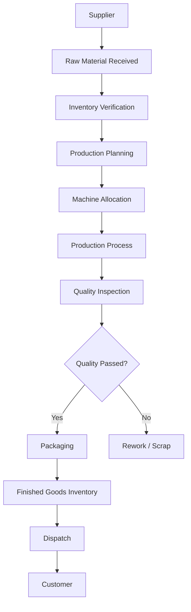

# 🏭 Manufacturing Management System

> **Business Case Study | Software Design | System Architecture | Database Design**

---

## 📖 Overview

This repository presents a software engineering case study for a Manufacturing Management System designed for small and medium-sized manufacturing industries.

The objective of this project was to understand how software can improve manufacturing operations by analysing existing business processes and designing a centralized software solution.

Instead of developing the application, this project focuses on requirement analysis, software architecture, database planning, module design, and business workflow.

---

## 🏭 Business Scenario

A manufacturing company produces products in multiple production batches every day. Most operational activities are recorded manually using paper registers and Excel sheets.

As production increases, managing information manually becomes difficult and often leads to delays, duplicate records, and communication gaps between departments.

This case study proposes a centralized web-based system that helps manage production, inventory, maintenance, employees, and reporting from a single platform.

---

## ❗ Problem Statement

The existing workflow depends heavily on manual processes.

Some common challenges include:

- Manual production records
- Inventory mismatches
- Delayed report generation
- Machine maintenance not tracked properly
- No centralized dashboard
- Difficult communication between departments
- Time-consuming data retrieval

---

## 🎯 Objectives

- Digitize manufacturing operations
- Reduce paperwork
- Improve inventory visibility
- Track production in real time
- Schedule preventive maintenance
- Generate reports automatically
- Improve decision making using dashboards

---
## 🔄 Current Manufacturing Workflow

The following diagram represents a typical manufacturing workflow observed in small and medium-scale manufacturing industries.

---

## 💡 Proposed Software Solution

The proposed Manufacturing Management System centralizes different business operations into a single platform.

Instead of maintaining separate Excel sheets and paper records, every department interacts with one integrated system.

The software is divided into multiple independent modules, making it scalable and easier to maintain.

---

## 📦 Proposed Modules

### 📊 Dashboard

Provides a quick overview of manufacturing activities.

Features:

- Daily Production Summary
- Machine Utilization
- Employee Attendance
- Inventory Alerts
- Pending Maintenance
- Recent Activities

---

### 🏭 Production Management

Responsible for handling daily production activities.

Features:

- Create Production Batch
- Assign Machine
- Assign Operator
- Track Production Status
- Close Production Batch
- View Production History

---

### 📦 Inventory Management

Maintains stock details for raw materials and finished products.

Features:

- Add New Items
- Update Stock
- Low Stock Alerts
- Supplier Information
- Stock Movement History

---

### 🔧 Maintenance Management

Helps track machine servicing and breakdown history.

Features:

- Preventive Maintenance Schedule
- Breakdown Reporting
- Maintenance History
- Machine Availability
- Service Log

---

### 👨‍💼 Employee Management

Stores employee information and manages attendance.

Features:

- Employee Records
- Shift Allocation
- Attendance
- Department Information

---

### 📑 Reports

Generates business reports automatically.

Reports include:

- Daily Production Report
- Monthly Production Report
- Inventory Report
- Machine Downtime Report
- Employee Attendance Report

---

## 👥 Stakeholders

The following users interact with the proposed system.

| User | Responsibilities |
|------|------------------|
| Plant Manager | Monitor production and reports |
| Production Supervisor | Manage production batches |
| Machine Operator | Update production status |
| Store Manager | Manage inventory |
| Maintenance Engineer | Handle machine servicing |
| HR | Employee records and attendance |
| Management | Business insights and analytics |

---

## ✅ Expected Benefits

- Centralized business data
- Reduced paperwork
- Faster report generation
- Better inventory tracking
- Improved maintenance planning
- Better communication between departments
- Increased operational efficiency
